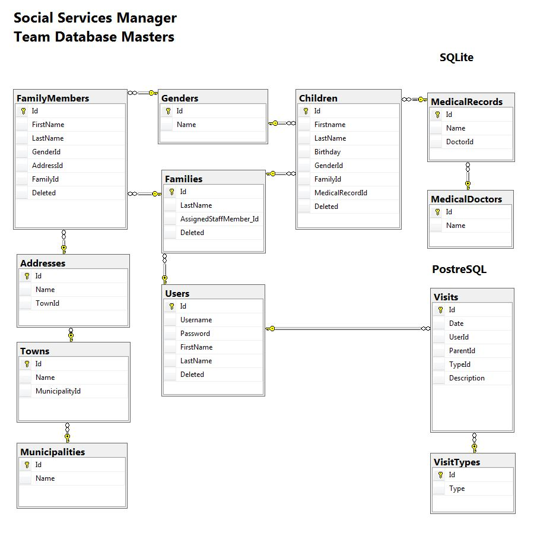

## Databases: Teamwork Assignement
# Team Database Masters - Social Services Manager

## Project Description
Management tool for monitoring and organizing social service visits for families with young children. 

The database is organised in tables in SQL Server, PostgreSQL and SQLite.
Data create, read, update, delete is implemented through a console application.
Data can be inported from XML and JSON and eported to PDF.

### Data Relations
- The staff of the social service (`Users`) keep track of the `Families` they work with. Each family has one `Assigned Staff Member`, one or more `Family Members` and one or more `Children`. Staff members conduct `Visits` to `Families` during which they provide advice and assistance to `Family Members` for the care and welbeing of the `Children`.

- `Children` have one or more `Medical Records` tracked by one or more `Medical Doctors`

[Diagram](#database-diagram)

[Commands Samples](./CommandsSamples.md)

## Team Members

| Names               | Email                      | Username            | Tasks                                   |
| ------------------- | -------------------------- | ------------------- | --------------------------------------- |
| Aleksandar Ikonomov | aleksandar.ikonomov@abv.bg | a.ikonomov          | SQLite, PDF export, StyleCop            |
| Milena Sapunova     | milena.sapunova@gmail.com  | milena.aleksandrova | PostgreSQL, Import, Models, Constraints |
| Nadezhda Hristova   | epohster@gmail.com         | nhristova           | Structure, CRUD Commands, Validation    |

## Links

|   [GitHub](https://github.com/DatabaseMasters)    |   [Showcase](#)   |   [YouTube](#)    |

## General Requirements Covered
+ Code First approach
+ Entity Framework
+ SQL Server 2016 - one team member used SQL Server 2014
+ At least five tables in the SQL Server database
+ All type of relations in the database - except one-to-one
+ Attributes and the Fluent API (Model builder) for configuration
+ Data in SQLite and PostgreSQL
+ Data loaded from external files - XML, JSON
+ The user is able to manipulate the database through the client 
+ Usable user interface for the client - console
+ PDF reports 

## Additional Requirements Covered
+ **iTextSharp** library used for PDF export 
+ **Newtonsoft.JSON** used for JSON deserializations of imported data
+ **.NET XmlSerializer** used for XML deserializations of imported data

## Optional Requirements 
+ Pure Entity Framework and DbContext

- @!TODO! **Unit Tests**

## Database Diagram

